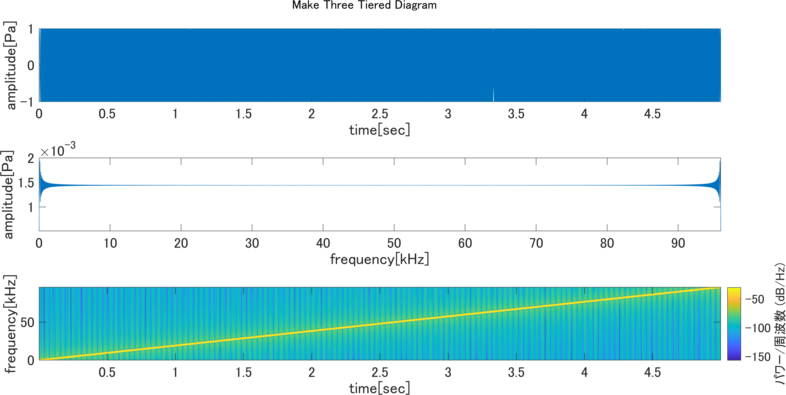
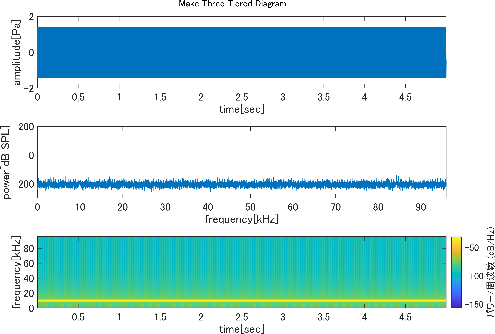
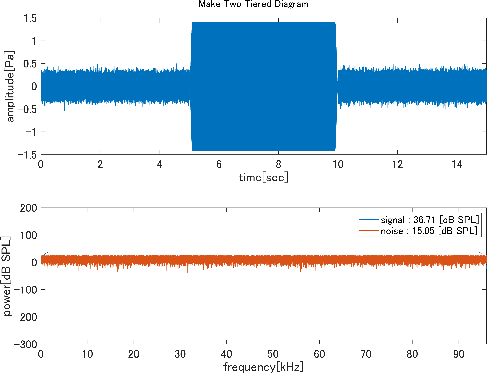
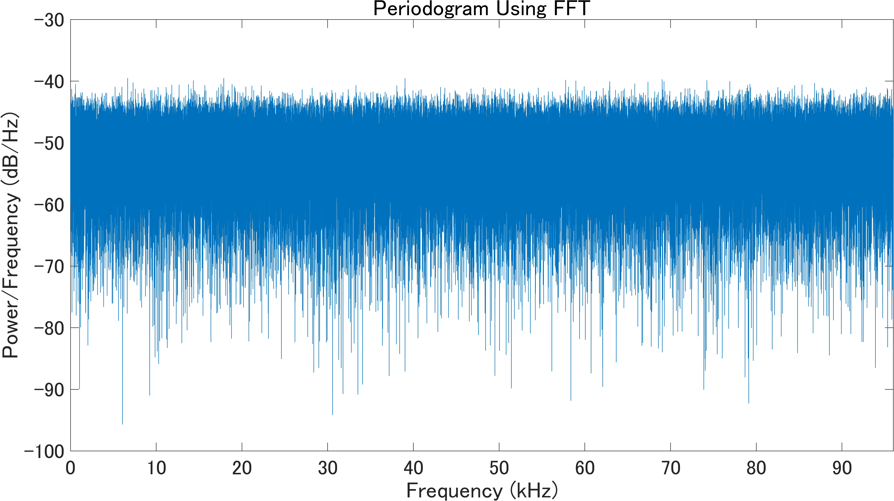

# このフォルダについて
202年度matlabの備忘録

# make_three_tiered_diagram.mについて

### 出力

# make_two_tiered_diagram.mについて

### 出力

# power_spectral_density.mについて

### 出力

### 参考文献

- [FFTアナライザ よくあるご質問](https://www.onosokki.co.jp/HP-WK/c_support/faq/fft_common/fft_spectrum_13.htm), 株式会社 小野測器 , 参照日：2021年6月19日

- [基礎からの周波数分析（13）－「パワースペクトル（その２）」](https://www.onosokki.co.jp/HP-WK/eMM_back/emm148.pdf), 株式会社 小野測器 , 参照日：2021年6月19日

- [ホワイト ガウス ノイズ サンプルの生成](https://jp.mathworks.com/help/comm/ref/wgn.html#mw_58fa5b7c-c1d5-4056-99bb-b116b747b563), MathWorks , 参照日：2021年6月19日

- [高速フーリエ変換](https://jp.mathworks.com/help/matlab/ref/fft.html), MathWorks , 参照日：2021年6月19日

- [FFT を使用したパワー スペクトル密度推定](https://jp.mathworks.com/help/signal/ug/power-spectral-density-estimates-using-fft.html), MathWorks , 参照日：2021年6月19日

- [ピリオドグラム パワー スペクトル密度推定](https://jp.mathworks.com/help/signal/ref/periodogram.html#d123e108867), MathWorks , 参照日：2021年6月19日

- [デジタル通信と雑音](http://www.oit.ac.jp/elc/~kumamoto/radio/08.pdf), 大阪工業大学 , 参照日：2021年6月24日

# calculate_calibration_value.mについて

ADコンバータからパソコンのソフトウエアまでの、
校正値(較正値)を求めるためのプログラムです。

# 作成日
2021年6月24日
